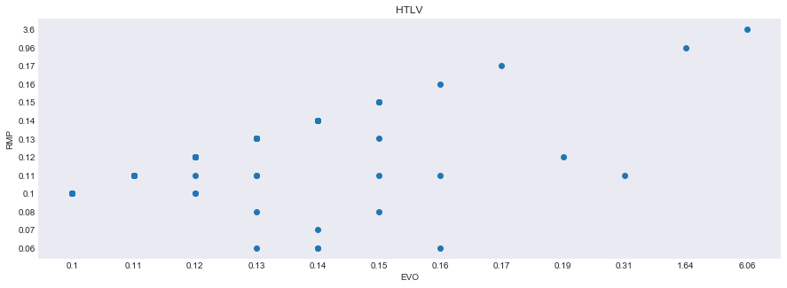
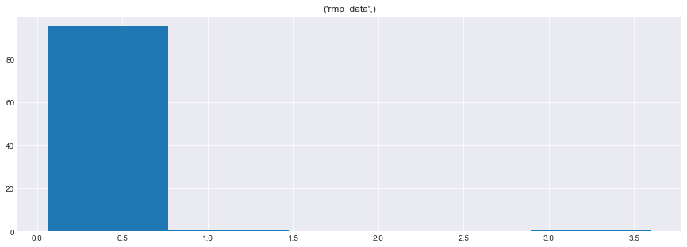
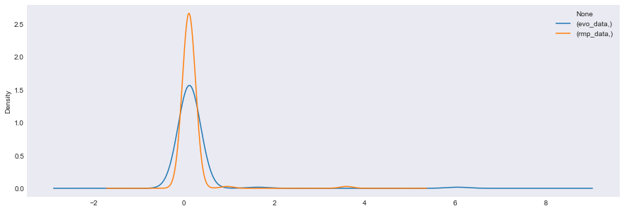
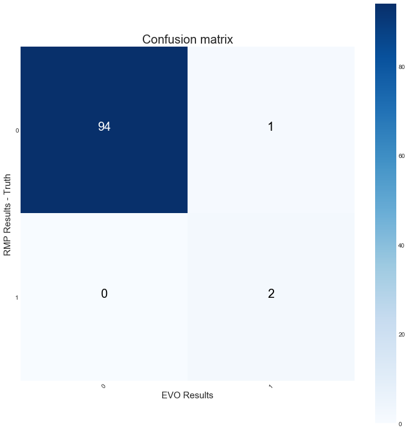

```python
# importing necessary libraries for analysis 
import pandas as pd
import numpy as np
import matplotlib.pyplot as plt
import seaborn as sns
import statsmodels as sm 
from scipy.stats import pearsonr
from numpy.random import seed
from numpy import mean
from numpy import var
from math import sqrt
from pandas_ml import ConfusionMatrix
from sklearn.metrics import confusion_matrix
import itertools

# Use ggplot style for visulizations
plt.style.use('seaborn-dark')
```


```python
# Import Syph data
data = pd.read_excel('HTLV1.xlsx', index=False)

# Read the required columns
data = data[['sample_id', 'data_1', 'co_1', 'data_2', 'co_2']]

# Set new column names
data.columns = [['id', 'evo_data', 'evo_resp', 'rmp_data', 'rmp_resp']]

# Change negative and positive values to 0 and 1 respectively 
data = data.replace('POSITIVE', 1)
data = data.replace('Negative', 0)
data = data.replace('EQUIVOCAL', 1)


# Print columns and head
print(data.columns)
data.head()
```

    MultiIndex(levels=[['evo_data', 'evo_resp', 'id', 'rmp_data', 'rmp_resp']],
               labels=[[2, 0, 1, 3, 4]])


<div>
<style scoped>
    .dataframe tbody tr th:only-of-type {
        vertical-align: middle;
    }

    .dataframe tbody tr th {
        vertical-align: top;
    }

    .dataframe thead tr th {
        text-align: left;
    }
</style>
<table border="1" class="dataframe">
  <thead>
    <tr>
      <th></th>
      <th>id</th>
      <th>evo_data</th>
      <th>evo_resp</th>
      <th>rmp_data</th>
      <th>rmp_resp</th>
    </tr>
  </thead>
  <tbody>
    <tr>
      <th>0</th>
      <td>18V0003736</td>
      <td>0.13</td>
      <td>0</td>
      <td>0.11</td>
      <td>0</td>
    </tr>
    <tr>
      <th>1</th>
      <td>18V0003895</td>
      <td>0.12</td>
      <td>0</td>
      <td>0.10</td>
      <td>0</td>
    </tr>
    <tr>
      <th>2</th>
      <td>18V0003901</td>
      <td>0.16</td>
      <td>0</td>
      <td>0.11</td>
      <td>0</td>
    </tr>
    <tr>
      <th>3</th>
      <td>18V0004030</td>
      <td>0.15</td>
      <td>0</td>
      <td>0.11</td>
      <td>0</td>
    </tr>
    <tr>
      <th>4</th>
      <td>18V0004031</td>
      <td>0.13</td>
      <td>0</td>
      <td>0.11</td>
      <td>0</td>
    </tr>
  </tbody>
</table>
</div>


```python
# Describe the 5 point statistics of the dataset
data.describe()
```


<div>
<style scoped>
    .dataframe tbody tr th:only-of-type {
        vertical-align: middle;
    }

    .dataframe tbody tr th {
        vertical-align: top;
    }

    .dataframe thead tr th {
        text-align: left;
    }
</style>
<table border="1" class="dataframe">
  <thead>
    <tr>
      <th></th>
      <th>evo_data</th>
      <th>evo_resp</th>
      <th>rmp_data</th>
      <th>rmp_resp</th>
    </tr>
  </thead>
  <tbody>
    <tr>
      <th>count</th>
      <td>97.000000</td>
      <td>97.000000</td>
      <td>97.000000</td>
      <td>97.000000</td>
    </tr>
    <tr>
      <th>mean</th>
      <td>0.201340</td>
      <td>0.030928</td>
      <td>0.158763</td>
      <td>0.020619</td>
    </tr>
    <tr>
      <th>std</th>
      <td>0.620981</td>
      <td>0.174022</td>
      <td>0.363869</td>
      <td>0.142842</td>
    </tr>
    <tr>
      <th>min</th>
      <td>0.100000</td>
      <td>0.000000</td>
      <td>0.060000</td>
      <td>0.000000</td>
    </tr>
    <tr>
      <th>25%</th>
      <td>0.110000</td>
      <td>0.000000</td>
      <td>0.110000</td>
      <td>0.000000</td>
    </tr>
    <tr>
      <th>50%</th>
      <td>0.120000</td>
      <td>0.000000</td>
      <td>0.110000</td>
      <td>0.000000</td>
    </tr>
    <tr>
      <th>75%</th>
      <td>0.130000</td>
      <td>0.000000</td>
      <td>0.130000</td>
      <td>0.000000</td>
    </tr>
    <tr>
      <th>max</th>
      <td>6.060000</td>
      <td>1.000000</td>
      <td>3.600000</td>
      <td>1.000000</td>
    </tr>
  </tbody>
</table>
</div>


```python
# Scatter plot between evo and rmp data readings 

from pylab import rcParams
rcParams['figure.figsize'] = 15, 5
plt.scatter(data.evo_data, data.rmp_data)
plt.xlabel('EVO')
plt.ylabel('RMP')
plt.title('HTLV')
plt.show()
```





```python
# Plot histograms to inspect the typical values

data['evo_data'].hist(bins=5)
data['rmp_data'].hist(bins=5)

```


    array([[<matplotlib.axes._subplots.AxesSubplot object at 0x117225cc0>]],
          dtype=object)





```python
# Plot distributions as overlapping kde plots

kde = data[['evo_data', 'rmp_data']].copy()
kde.plot.kde()
```


    <matplotlib.axes._subplots.AxesSubplot at 0x117188908>





```python
# Convert data to numpy arrays and calculate pearson correlation coefficient

x = np.array(data.evo_data)
y = np.array(data.rmp_data)
```


```python
# Pearson Correlation

corr, _ = pearsonr(x,y)
print('Pearsons correlation: %.3f' % corr)
```

    Pearsons correlation: 0.998


```python
# Effect Size Measurement

# function to calculate Cohen's d for independent samples
def cohend(d1, d2):
    # calculate the size of samples
    n1, n2 = len(d1), len(d2)
    # calculate the variance of the samples
    s1, s2 = var(d1, ddof=1), var(d2, ddof=1)
    # calculate the pooled standard deviation
    s = sqrt(((n1 - 1) * s1 + (n2 - 1) * s2) / (n1 + n2 - 2))
    # calculate the means of the samples
    u1, u2 = mean(d1), mean(d2)
    # calculate the effect size
    return (u1 - u2) / s


d = cohend(y,x)
print('Cohens d: %.3f' % d)
```

    Cohens d: -0.084


```python
# Run Independant and dependant t-tests 

from scipy import stats
stats.ttest_ind(y,x)
```


    Ttest_indResult(statistic=array([-0.58262826]), pvalue=array([0.56082719]))


```python
stats.ttest_rel(y,x)
```


    Ttest_relResult(statistic=array([-1.62038962]), pvalue=array([0.10842895]))


```python
# Calculate confusion and matrix and diagnosticsa

EVO=np.hstack(np.array(data['evo_resp']))
RMP=np.hstack(np.array(data['rmp_resp']))

cm = ConfusionMatrix(RMP, EVO)
print(cm)
cm.print_stats()
```

    Predicted  False  True  __all__
    Actual                         
    False         94     1       95
    True           0     2        2
    __all__       94     3       97
    population: 97
    P: 2
    N: 95
    PositiveTest: 3
    NegativeTest: 94
    TP: 2
    TN: 94
    FP: 1
    FN: 0
    TPR: 1.0
    TNR: 0.9894736842105263
    PPV: 0.6666666666666666
    NPV: 1.0
    FPR: 0.010526315789473684
    FDR: 0.3333333333333333
    FNR: 0.0
    ACC: 0.9896907216494846
    F1_score: 0.8
    MCC: 0.8121878617703034
    informedness: 0.9894736842105263
    markedness: 0.6666666666666665
    prevalence: 0.020618556701030927
    LRP: 95.0
    LRN: 0.0
    DOR: inf
    FOR: 0.0


    /anaconda3/lib/python3.6/site-packages/pandas_ml/confusion_matrix/bcm.py:346: RuntimeWarning: divide by zero encountered in double_scalars
      return(np.float64(self.LRP) / self.LRN)


```python
# Draw Confusion matrix for report
# Motivation for this visualization has been taken from stackoverflow discussion at:
# https://stackoverflow.com/questions/48817300/sklearn-plot-confusion-matrix-combined-across-trainingtest-sets

from pylab import rcParams
rcParams['figure.figsize'] = 10,10

def plot_confusion_matrix(cm, classes,
                          normalize=False,
                          title='Confusion matrix',
                          cmap=plt.cm.Blues):
    """
    This function prints and plots the confusion matrix.
    Normalization can be applied by setting `normalize=True`.
    """
    if normalize:
        cm = cm.astype('float') / cm.sum(axis=1)[:, np.newaxis]
        print("Normalized confusion matrix")
    else:
        print('Confusion matrix, without normalization')

    print(cm)

    plt.imshow(cm, interpolation='nearest', cmap='Blues')
    plt.title(title, fontsize=20)
    plt.colorbar()
    tick_marks = np.arange(len(classes))
    plt.xticks(tick_marks, classes, rotation=45)
    plt.yticks(tick_marks, classes)

    fmt = '.2f' if normalize else 'd'
    thresh = cm.max() / 2.
    for i, j in itertools.product(range(cm.shape[0]), range(cm.shape[1])):
        plt.text(j, i, format(cm[i, j], fmt ), fontsize = 20,
                 horizontalalignment="center",
                 color="white" if cm[i, j] > thresh else "black")

    plt.tight_layout()
    plt.ylabel('RMP Results - Truth', fontsize=15)
    plt.xlabel('EVO Results', fontsize=15)


cm = confusion_matrix(RMP, EVO)

plt.figure()
plot_confusion_matrix(cm, classes = [0,1], title='Confusion matrix')
```

    Confusion matrix, without normalization
    [[94  1]
     [ 0  2]]




