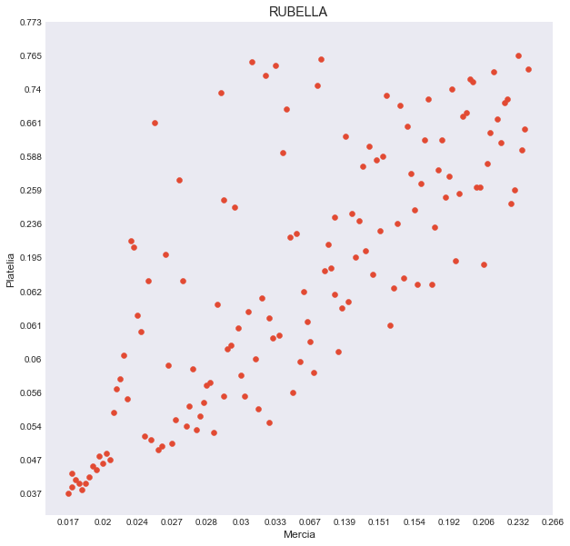
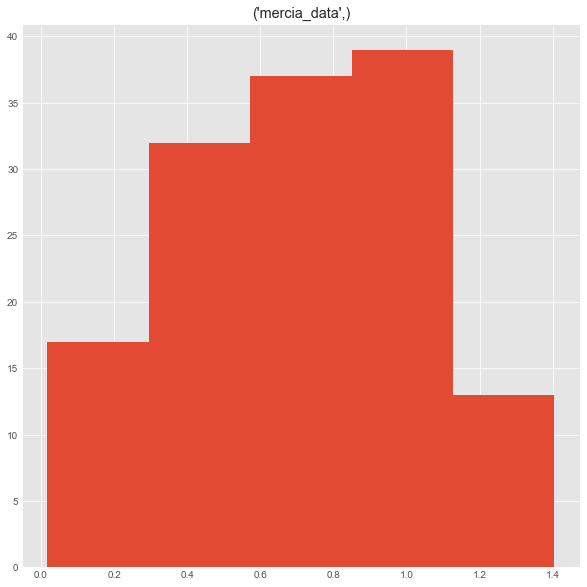
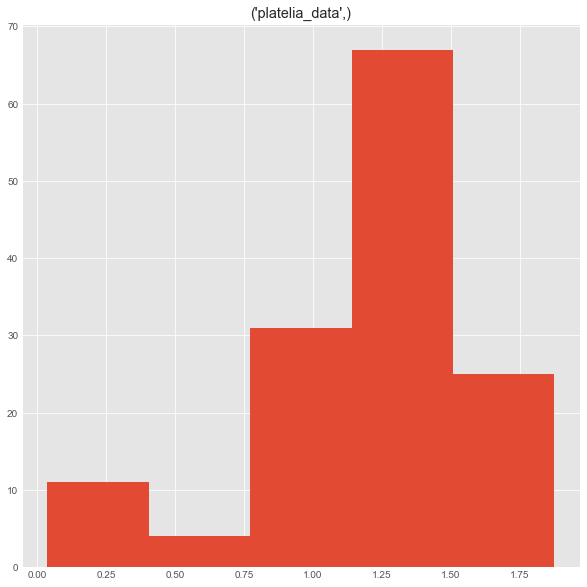
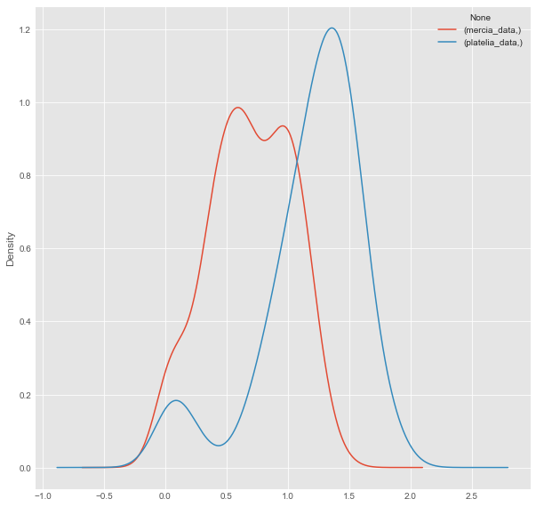
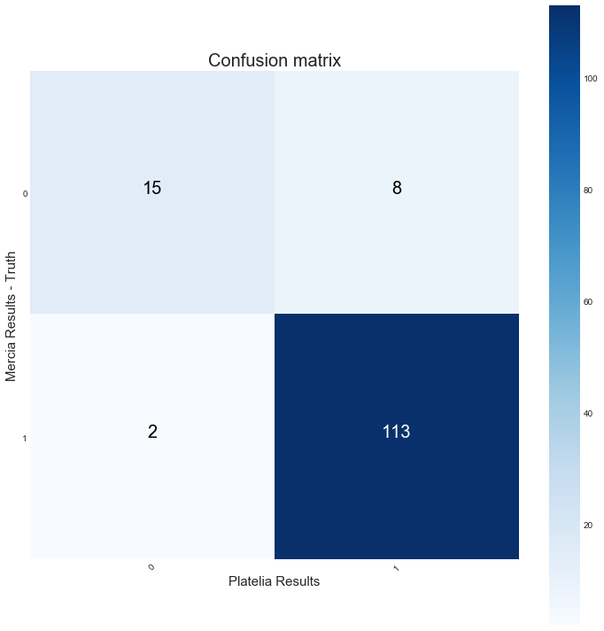

```python
# importing necessary libraries for analysis 
import pandas as pd
import numpy as np
import matplotlib.pyplot as plt
import seaborn as sns
import statsmodels as sm 
from scipy.stats import pearsonr
from numpy.random import seed
from numpy import mean
from numpy import var
from math import sqrt
from pandas_ml import ConfusionMatrix
from sklearn.metrics import confusion_matrix
import itertools

# Use ggplot style for visulizations
plt.style.use('ggplot')
```


```python
# # Import Rubella data
#
data = pd.read_excel('Rubella1.xlsx', index=False)

# Read the required columns
data = data[['sample_id', 'od_1', 'result_1', 'od_2', 'result_2']]

# Set new column names
data.columns = [['id', 'mercia_data', 'mercia_resp', 'platelia_data', 'platelia_resp']]

# Change negative and positive values to 0 and 1 respectively 
data = data.replace('Positive', 1)
data = data.replace('NEGATIVE', 0)
data = data.replace('EQUIVOCAL', 0)


# Print columns and head
print(data.columns)
data.head()
```

    MultiIndex(levels=[['id', 'mercia_data', 'mercia_resp', 'platelia_data', 'platelia_resp']],
               labels=[[0, 1, 2, 3, 4]])


<div>
<style scoped>
    .dataframe tbody tr th:only-of-type {
        vertical-align: middle;
    }

    .dataframe tbody tr th {
        vertical-align: top;
    }

    .dataframe thead tr th {
        text-align: left;
    }
</style>
<table border="1" class="dataframe">
  <thead>
    <tr>
      <th></th>
      <th>id</th>
      <th>mercia_data</th>
      <th>mercia_resp</th>
      <th>platelia_data</th>
      <th>platelia_resp</th>
    </tr>
  </thead>
  <tbody>
    <tr>
      <th>0</th>
      <td>16V0090107</td>
      <td>0.949</td>
      <td>1</td>
      <td>1.560</td>
      <td>1</td>
    </tr>
    <tr>
      <th>1</th>
      <td>16V0090602</td>
      <td>0.902</td>
      <td>1</td>
      <td>1.272</td>
      <td>1</td>
    </tr>
    <tr>
      <th>2</th>
      <td>16V0090604</td>
      <td>0.192</td>
      <td>0</td>
      <td>0.740</td>
      <td>0</td>
    </tr>
    <tr>
      <th>3</th>
      <td>16V0090660</td>
      <td>1.012</td>
      <td>1</td>
      <td>1.258</td>
      <td>1</td>
    </tr>
    <tr>
      <th>4</th>
      <td>16V0090346</td>
      <td>1.229</td>
      <td>1</td>
      <td>1.427</td>
      <td>1</td>
    </tr>
  </tbody>
</table>
</div>


```python
# Describe the 5 point statistics of the dataset
data.describe()
```


<div>
<style scoped>
    .dataframe tbody tr th:only-of-type {
        vertical-align: middle;
    }

    .dataframe tbody tr th {
        vertical-align: top;
    }

    .dataframe thead tr th {
        text-align: left;
    }
</style>
<table border="1" class="dataframe">
  <thead>
    <tr>
      <th></th>
      <th>mercia_data</th>
      <th>mercia_resp</th>
      <th>platelia_data</th>
      <th>platelia_resp</th>
    </tr>
  </thead>
  <tbody>
    <tr>
      <th>count</th>
      <td>138.000000</td>
      <td>138.000000</td>
      <td>138.000000</td>
      <td>138.000000</td>
    </tr>
    <tr>
      <th>mean</th>
      <td>0.694370</td>
      <td>0.833333</td>
      <td>1.192522</td>
      <td>0.876812</td>
    </tr>
    <tr>
      <th>std</th>
      <td>0.337968</td>
      <td>0.374036</td>
      <td>0.411154</td>
      <td>0.329851</td>
    </tr>
    <tr>
      <th>min</th>
      <td>0.017000</td>
      <td>0.000000</td>
      <td>0.037000</td>
      <td>0.000000</td>
    </tr>
    <tr>
      <th>25%</th>
      <td>0.450750</td>
      <td>1.000000</td>
      <td>1.026250</td>
      <td>1.000000</td>
    </tr>
    <tr>
      <th>50%</th>
      <td>0.689500</td>
      <td>1.000000</td>
      <td>1.269500</td>
      <td>1.000000</td>
    </tr>
    <tr>
      <th>75%</th>
      <td>0.980000</td>
      <td>1.000000</td>
      <td>1.467750</td>
      <td>1.000000</td>
    </tr>
    <tr>
      <th>max</th>
      <td>1.405000</td>
      <td>1.000000</td>
      <td>1.876000</td>
      <td>1.000000</td>
    </tr>
  </tbody>
</table>
</div>


```python
# Scatter plot between evo and rmp data readings 

from pylab import rcParams
rcParams['figure.figsize'] = 10, 10
plt.scatter(data.mercia_data, data.platelia_data)
plt.xlabel('Mercia')
plt.ylabel('Platelia')
plt.title('RUBELLA')
plt.xticks(np.arange(0, 150, step=10))
plt.yticks(np.arange(0, 150, step=10))

plt.show()
```





```python
# Plot histograms to inspect the typical values

data['mercia_data'].hist(bins=5)
data['platelia_data'].hist(bins=5)

```


    array([[<matplotlib.axes._subplots.AxesSubplot object at 0x1a19ed4048>]],
          dtype=object)








```python
# Plot distributions as overlapping kde plots

kde = data[['mercia_data', 'platelia_data']].copy()
kde.plot.kde()
```


    <matplotlib.axes._subplots.AxesSubplot at 0x1a1ab96160>





```python
# Convert data to numpy arrays and calculate pearson correlation coefficient

x = np.array(data.mercia_data)
y = np.array(data.platelia_data)
```


```python
# Pearson Correlation

corr, _ = pearsonr(x,y)
print('Pearsons correlation: %.3f' % corr)
```

    Pearsons correlation: 0.792


```python
# Effect Size Measurement

# function to calculate Cohen's d for independent samples
def cohend(d1, d2):
    # calculate the size of samples
    n1, n2 = len(d1), len(d2)
    # calculate the variance of the samples
    s1, s2 = var(d1, ddof=1), var(d2, ddof=1)
    # calculate the pooled standard deviation
    s = sqrt(((n1 - 1) * s1 + (n2 - 1) * s2) / (n1 + n2 - 2))
    # calculate the means of the samples
    u1, u2 = mean(d1), mean(d2)
    # calculate the effect size
    return (u1 - u2) / s


d = cohend(x,y)
print('Cohens d: %.3f' % d)
```

    Cohens d: -1.324


```python
# Run Independant and dependant t-tests 

from scipy import stats
stats.ttest_ind(x,y)
```


    Ttest_indResult(statistic=array([-10.99514822]), pvalue=array([1.5499312e-23]))


```python
stats.ttest_rel(x,y)
```


    Ttest_relResult(statistic=array([-23.30636097]), pvalue=array([1.62623851e-49]))


```python
# Calculate confusion and matrix and diagnosticsa

merc=np.hstack(np.array(data['mercia_resp']))
plat=np.hstack(np.array(data['platelia_resp']))

cm = ConfusionMatrix(merc, plat)
print(cm)
cm.print_stats()
```

    Predicted  False  True  __all__
    Actual                         
    False         15     8       23
    True           2   113      115
    __all__       17   121      138
    population: 138
    P: 115
    N: 23
    PositiveTest: 121
    NegativeTest: 17
    TP: 113
    TN: 15
    FP: 8
    FN: 2
    TPR: 0.9826086956521739
    TNR: 0.6521739130434783
    PPV: 0.9338842975206612
    NPV: 0.8823529411764706
    FPR: 0.34782608695652173
    FDR: 0.06611570247933884
    FNR: 0.017391304347826087
    ACC: 0.927536231884058
    F1_score: 0.9576271186440678
    MCC: 0.7198147009437228
    informedness: 0.6347826086956521
    markedness: 0.8162372386971317
    prevalence: 0.8333333333333334
    LRP: 2.825
    LRN: 0.026666666666666665
    DOR: 105.93750000000001
    FOR: 0.11764705882352941


```python
# Draw Confusion matrix for report
# Motivation for this visualization has been taken from stackoverflow discussion at:
# https://stackoverflow.com/questions/48817300/sklearn-plot-confusion-matrix-combined-across-trainingtest-sets

from pylab import rcParams
rcParams['figure.figsize'] = 10,10
plt.style.use('seaborn-dark')

def plot_confusion_matrix(cm, classes,
                          normalize=False,
                          title='Confusion matrix',
                          cmap=plt.cm.Blues):
    """
    This function prints and plots the confusion matrix.
    Normalization can be applied by setting `normalize=True`.
    """
    if normalize:
        cm = cm.astype('float') / cm.sum(axis=1)[:, np.newaxis]
        print("Normalized confusion matrix")
    else:
        print('Confusion matrix, without normalization')

    print(cm)

    plt.imshow(cm, interpolation='nearest', cmap='Blues')
    plt.title(title, fontsize=20)
    plt.colorbar()
    tick_marks = np.arange(len(classes))
    plt.xticks(tick_marks, classes, rotation=45)
    plt.yticks(tick_marks, classes)

    fmt = '.2f' if normalize else 'd'
    thresh = cm.max() / 2.
    for i, j in itertools.product(range(cm.shape[0]), range(cm.shape[1])):
        plt.text(j, i, format(cm[i, j], fmt ), fontsize = 20,
                 horizontalalignment="center",
                 color="white" if cm[i, j] > thresh else "black")

    plt.tight_layout()
    plt.ylabel('Mercia Results - Truth', fontsize=15)
    plt.xlabel('Platelia Results', fontsize=15)


cm = confusion_matrix(EVO,RMP)

plt.figure()
plot_confusion_matrix(cm, classes = [0,1], title='Confusion matrix')
```

    Confusion matrix, without normalization
    [[ 15   8]
     [  2 113]]




